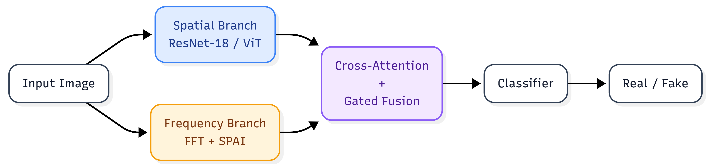
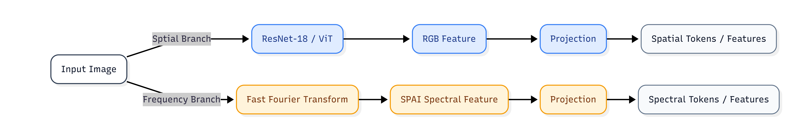
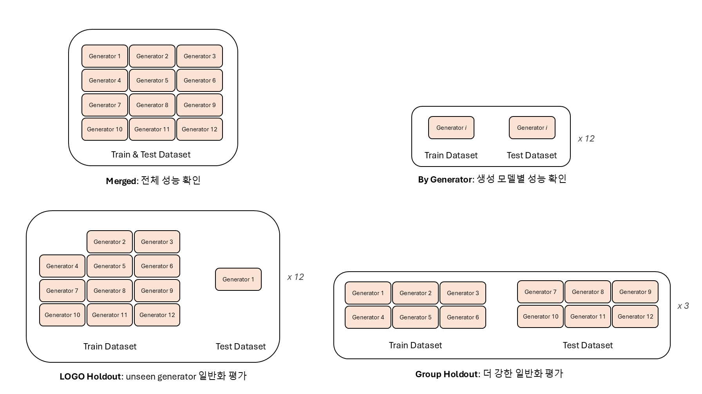

# Toward Generalizable and Robust Deepfake Detection: A Spatial-Frequency Fusion Baseline

This repository presents a deepfake image detection project focused on **generalization** and **robustness**.  
The core idea is to compare **spatial-only**, **frequency-only**, and **spatial-frequency fusion** models on **OpenFake**, and then evaluate whether the learned detector transfers to corrupted test conditions.

## Overview

Recent image generators produce highly realistic images, making real/fake classification increasingly difficult.  
This project studies whether frequency-domain cues provide complementary information to standard RGB features, and whether combining both improves robustness under generator shifts and corrupted test conditions.

The project is organized around three questions:

- Can a spatial model alone generalize to unseen generators?
- Does a frequency-based model capture useful artifacts missed by RGB-only models?
- Does fusion improve robustness under distribution shift?

<p align="center">
  
</p>

<p align="center">
  <b>Figure 1.</b> Overall framework of the proposed spatial-frequency deepfake detection pipeline.
</p>

## Methods

We compare three detector families:

- **Spatial-only**
  - ResNet-18
  - ViT

- **Frequency-only**
  - SPAI-style spectral encoder based on ViT

- **Fusion**
  - ResNet-18 + SPAI
  - ViT + SPAI

The frequency branch uses transformed spectral representations to capture generator-specific artifacts that may be weak in pixel space. The fusion model combines spatial and spectral features to produce the final binary prediction.

In the fusion models, spatial and spectral features are combined using a cross-attention-based fusion module. To improve training stability and generalization, fusion models are additionally trained with branch dropout and auxiliary classification heads for each branch. Temperature scaling is applied as a post-hoc calibration step. For robustness evaluation, robustness-aware training is used to expose models to image degradations during training.

<p align="center">
  
</p>

<p align="center">
  <b>Figure 2.</b> Branch-level architecture of the spatial, frequency, and fusion-based detectors.
</p>

Branch dropout and auxiliary losses are applied only to fusion models, while temperature scaling and robustness-aware training can be applied to all model families.

## Dataset

### [OpenFake](https://huggingface.co/datasets/ComplexDataLab/OpenFake)
OpenFake is used as the primary dataset for training and evaluation.  
This project focuses on binary classification between real images and AI-generated images.

The generated image subset consists of images from the following 12 generators: `DALL·E 3`, `FLUX 1.1 Pro`, `FLUX MVC5000`, `FLUX.1 Dev`, `GPT-Image-1`, `Grok-2-Image-1212`, `HiDream-I1-Full`, `Ideogram 3.0`, `Imagen 4.0`, `Midjourney 6`, `Stable Diffusion 3.5`, `SDXL Epic Realism`.

This project uses OpenFake under multiple evaluation settings:

- **Merged**: standard mixed-generator evaluation
- **By Generator**: per-generator test splits for generalization analysis
- **LOGO holdout**: leave-one-generator-out evaluation, where one generator is excluded from training and used for testing
- **Group holdout**: group-level generator holdout evaluation

<p align="center">
  
</p>

<p align="center">
  <b>Figure 3.</b> Evaluation protocols for merged, by-generator, LOGO holdout, and group holdout.
</p>

## Evaluation

The project evaluates performance with:

- Accuracy
- Precision
- Recall
- F1-score
- ROC-AUC
- Corruption robustness under JPEG, blur, noise, and resize degradations

For by-generator and LOGO evaluations, results are averaged over 12 generator-specific evaluations. For group holdout, each generator appears in at least one held-out group evaluation. For corruption robustness, JPEG, blur, noise, and resize scores are averaged over severity levels.

## Main Results

### Main detection and generalization performance (AUC / F1 (%))

| Model           | Setting  | Merged        | By-generator  | LOGO holdout  | Group holdout |
|-----------------|----------|--------------:|--------------:|--------------:|--------------:|
| ResNet18        | Baseline | 99.06 / 95.50 | 99.49 / 96.95 | 95.87 / 85.43 | 94.50 / 82.69 |
| ResNet18        | Final    | 98.49 / 93.75 | 99.16 / 95.89 | 94.55 / 84.50 | 93.01 / 82.03 |
| ViT             | Baseline | 99.50 / 96.92 | 99.75 / 98.09 | 96.61 / 84.43 | 94.07 / 77.24 |
| ViT             | Final    | 99.49 / 96.61 | 99.69 / 97.70 | 96.39 / 84.98 | 94.38 / 80.87 |
| SPAI            | Baseline | 99.46 / 97.09 | 99.69 / 98.10 | 96.56 / 83.97 | 94.72 / 79.31 |
| SPAI            | Final    | 99.51 / 96.70 | 99.67 / 97.59 | 96.55 / 85.16 | 94.95 / 79.60 |
| ResNet18 + SPAI | Baseline | 99.41 / 96.49 | 99.68 / 97.82 | 96.50 / 84.49 | 94.86 / 79.71 |
| ResNet18 + SPAI | Final    | 99.32 / 95.57 | 99.58 / 97.16 | 96.30 / 85.35 | 94.72 / 80.77 |
| ViT + SPAI      | Baseline | 99.35 / 96.29 | 99.66 / 97.70 | 96.17 / 82.84 | 94.21 / 78.49 |
| ViT + SPAI      | Final    | 99.30 / 95.62 | 99.64 / 97.19 | 95.90 / 82.81 | 93.27 / 80.97 |

*“Final” denotes the strongest robustness-oriented setting for each model family. It includes temperature scaling and robustness-aware training for all models, while branch dropout and auxiliary losses are applied only to fusion models.*

### Ablation study of the proposed training components on fusion models (AUC/F1, %)

| Model | TS | BD | Aux | RAT | Merged | By-generator | LOGO | Group |
|---|:--:|:--:|:--:|:--:|---:|---:|---:|---:|
| ResNet18 + SPAI | ✗ | ✗ | ✗ | ✗ | 99.41 / 96.49 | 99.68 / 97.82 | 96.50 / 84.49 | 94.86 / 79.71 |
| ResNet18 + SPAI | ✓ | ✗ | ✗ | ✗ | 99.51 / 96.49 | 99.70 / 97.60 | 96.63 / 84.07 | 94.98 / 79.71 |
| ResNet18 + SPAI | ✗ | ✓ | ✓ | ✗ | 99.50 / 96.82 | 99.65 / 97.50 | 96.47 / 84.07 | 94.30 / 76.99 |
| ResNet18 + SPAI | ✓ | ✓ | ✓ | ✗ | 99.51 / 96.49 | 99.70 / 97.60 | 96.97 / 84.91 | 94.32 / 76.99 |
| ResNet18 + SPAI | ✓ | ✓ | ✓ | ✓ | 99.32 / 95.57 | 99.58 / 97.16 | 96.30 / 85.35 | 94.72 / 80.77 |
| ViT + SPAI | ✗ | ✗ | ✗ | ✗ | 99.35 / 96.29 | 99.66 / 97.70 | 96.17 / 82.84 | 94.21 / 78.49 |
| ViT + SPAI | ✓ | ✗ | ✗ | ✗ | 99.45 / 96.29 | 99.71 / 97.00 | 96.20 / 83.74 | 94.51 / 78.50 |
| ViT + SPAI | ✗ | ✓ | ✓ | ✗ | 99.53 / 96.66 | 99.72 / 98.01 | 96.17 / 83.14 | 94.05 / 79.14 |
| ViT + SPAI | ✓ | ✓ | ✓ | ✗ | 99.60 / 96.65 | 99.80 / 98.01 | 96.26 / 83.14 | 94.16 / 79.14 |
| ViT + SPAI | ✓ | ✓ | ✓ | ✓ | 99.30 / 95.62 | 99.64 / 97.19 | 95.90 / 82.81 | 93.27 / 80.97 |

*TS: temperature scaling, BD: branch dropout, Aux: auxiliary branch classification loss, RAT: robustness-aware training.*

### Corruption robustness on the merged test set (AUC / F1 (%))

| Model           | RAT | Clean         | JPEG          | Blur          | Noise         | Resize        | Mean          | Drop ↓       | Worst         |
|-----------------|:---:|--------------:|--------------:|--------------:|--------------:|--------------:|--------------:|-------------:|--------------:|
| ResNet18        | ✗   | 99.06 / 95.50 | 96.89 / 81.34 | 94.68 / 87.23 | 96.46 / 82.10 | 97.92 / 91.96 | 96.49 / 85.66 | 2.57 / 9.84  | 87.32 / 76.44 |
| ResNet18        | ✓   | 98.45 / 93.75 | 97.76 / 88.43 | 97.77 / 92.48 | 98.12 / 92.31 | 98.10 / 93.11 | 97.94 / 91.58 | 0.51 / 2.16  | 95.86 / 75.97 |
| ViT             | ✗   | 99.50 / 96.92 | 97.79 / 77.55 | 98.92 / 95.45 | 98.15 / 86.65 | 99.30 / 96.44 | 98.54 / 89.02 | 0.96 / 7.89  | 94.46 / 44.68 |
| ViT             | ✓   | 99.35 / 96.61 | 98.40 / 88.16 | 99.14 / 95.90 | 99.16 / 95.71 | 99.26 / 96.29 | 98.99 / 94.01 | 0.36 / 2.60  | 96.25 / 71.40 |
| SPAI            | ✗   | 99.46 / 97.09 | 95.51 / 75.02 | 96.43 / 90.31 | 97.36 / 84.09 | 98.84 / 95.45 | 97.04 / 86.22 | 2.43 / 10.87 | 86.93 / 37.58 |
| SPAI            | ✓   | 99.31 / 96.70 | 98.41 / 87.30 | 99.03 / 95.80 | 99.10 / 95.52 | 99.22 / 96.37 | 98.94 / 93.75 | 0.37 / 2.96  | 96.22 / 68.57 |
| ResNet18 + SPAI | ✗   | 99.41 / 96.49 | 97.52 / 74.87 | 95.22 / 89.21 | 97.65 / 82.11 | 98.75 / 94.86 | 97.28 / 85.26 | 2.13 / 11.23 | 87.34 / 77.83 |
| ResNet18 + SPAI | ✓   | 99.26 / 95.57 | 98.47 / 86.28 | 98.83 / 94.76 | 99.10 / 94.33 | 99.06 / 95.26 | 98.86 / 92.66 | 0.40 / 2.91  | 96.53 / 67.87 |
| ViT + SPAI      | ✗   | 99.35 / 96.29 | 97.62 / 76.36 | 97.06 / 91.15 | 97.93 / 83.94 | 98.95 / 95.36 | 97.89 / 86.71 | 1.46 / 9.58  | 92.76 / 82.43 |
| ViT + SPAI      | ✓   | 99.24 / 95.62 | 98.04 / 83.59 | 98.97 / 94.94 | 99.00 / 94.11 | 99.14 / 95.36 | 98.79 / 92.00 | 0.45 / 3.62  | 95.66 / 59.73 |

*JPEG, blur, noise, and resize results are averaged over corruption severity levels. “RAT” denotes robustness-aware training. “Mean” is the average over corrupted conditions. “Drop” is the performance decrease from clean evaluation to the mean corrupted evaluation. “Worst” denotes the lowest AUC/F1 observed across all corruption types and severity levels.*

### Key Findings

- In-domain performance is already high across all model families, making merged and by-generator settings less discriminative.
- Temperature scaling mainly provides small AUC improvements, while its effect on F1 is limited.
- Branch dropout and auxiliary losses are more effective for ViT + SPAI than for ResNet18 + SPAI, suggesting that branch regularization is backbone-dependent.
- Robustness-aware training substantially improves corruption robustness and reduces performance drops, especially in F1.
- Severe JPEG compression remains the most challenging corruption, particularly for fusion models.


## Installation

### 1) Clone the repository

```bash
git clone https://github.com/sangchun1/Deepfake-Fusion.git
cd Deepfake-Fusion
```

### 2) Install PyTorch

Install a PyTorch build that matches your CUDA / system environment first.

Example(CUDA 12.8):

```bash
pip install torch==2.7.1 torchvision==0.22.1 torchaudio==2.7.1 --index-url https://download.pytorch.org/whl/cu128
```

> If your CUDA version or platform is different, use [the official PyTorch install guide](https://pytorch.org/get-started/locally/)

### 3) Install dependencies

```bash
pip install -U pip
pip install -e .
```

For development dependencies:

```bash
pip install -e ".[dev]"
```

## Reproduction Pipeline

A typical full reproduction pipeline is:

```bash
# 1. Download OpenFake subset
python scripts/build_dataset.py \
  --dataset-id ComplexDataLab/OpenFake \
  --hf-split train \
  --output-root data/raw/openfake \
  --num-per-model 8000 \
  --seed 42 \
  --skip-bad-images

# 2. Build merged / by-generator / LOGO splits
python scripts/build_splits.py \
  --input-root data/raw/openfake \
  --output-root data/splits \
  --seed 42

# 3. Build group-holdout splits
python scripts/build_group_holdout_splits.py \
  --input_dir data/raw/openfake \
  --output_dir data/splits/group_holdout \
  --summary_json data/splits/summary.json \
  --seed 42

# 4. Train model
python -u scripts/run_batch_train.py \
  --mode all \
  --root_dir . \
  --base_data_config configs/data/default.yaml \
  --model_config configs/model/fusion_resnet.yaml \
  --train_config configs/train/fusion_resnet.yaml \
  --splits_root data/splits \
  --generated_config_dir configs/_generated/fusion_resnet \
  --output_root outputs/fusion/resnet_spai \
  --skip_existing_train

# 5. Fit temperature scaling
python -u scripts/run_batch_calibrate.py \
  --mode all \
  --root_dir . \
  --base_data_config configs/data/default.yaml \
  --model_config configs/model/fusion_resnet.yaml \
  --train_config configs/train/fusion_resnet.yaml \
  --splits_root data/splits \
  --generated_config_dir configs/_generated/calibrate_fusion_resnet \
  --output_root outputs/fusion/resnet_spai \
  --fit_split val \
  --skip_existing

# 6. Evaluate with temperature scaling
python -u scripts/run_batch_evaluate.py \
  --mode all \
  --root_dir . \
  --base_data_config configs/data/default.yaml \
  --model_config configs/model/fusion_resnet.yaml \
  --train_config configs/train/fusion_resnet.yaml \
  --splits_root data/splits \
  --generated_config_dir configs/_generated/eval_fusion_resnet \
  --output_root outputs/fusion/resnet_spai \
  --split test \
  --skip_existing

# 7. Evaluate corruption robustness
python -u scripts/run_batch_robustness.py \
  --mode all \
  --root_dir . \
  --base_data_config configs/data/default.yaml \
  --model_config configs/model/fusion_resnet.yaml \
  --train_config configs/train/fusion_resnet.yaml \
  --robustness_config configs/train/robustness.yaml \
  --splits_root data/splits \
  --generated_config_dir configs/_generated/robustness_fusion_resnet \
  --output_root outputs/fusion/resnet_spai \
  --split test \
  --skip_existing
```

## Dataset Preparation

This project uses the OpenFake dataset from Hugging Face.
Raw images are not included in this repository. Please download the dataset separately and build the experiment splits using the provided scripts.

### 1) Download the OpenFake subset

The following command downloads a balanced OpenFake subset with 12 fake generators and matching real images.

```bash
python scripts/build_dataset.py \
  --dataset-id ComplexDataLab/OpenFake \
  --hf-split train \
  --output-root data/raw/openfake \
  --num-per-model 8000 \
  --seed 42 \
  --skip-bad-images
```

By default, the script uses the following 12 generators:

```
sd-3.5
flux.1-dev
flux-1.1-pro
midjourney-6
dalle-3
gpt-image-1
ideogram-3.0
hidream-i1-full
grok-2-image-1212
imagen-4.0
sdxl-epic-realism
flux-mvc5000
```

The downloaded dataset is saved as:

```
data/raw/openfake/
├── real/
├── fake/
│   ├── sd-3.5/
│   ├── flux.1-dev/
│   └── ...
└── metadata/
    ├── selection.json
    ├── subset.csv
    └── summary.json
```

### 2) Build merged, by-generator, and LOGO splits

```bash
python scripts/build_splits.py \
  --input-root data/raw/openfake \
  --output-root data/splits \
  --seed 42
```

This creates:

```
data/splits/
├── merged/
│   ├── train.csv
│   ├── val.csv
│   └── test.csv
├── by_generator/
│   ├── sd-3.5/
│   ├── flux.1-dev/
│   └── ...
├── logo/
│   ├── sd-3.5/
│   ├── flux.1-dev/
│   └── ...
└── summary.json
```

### 3) Build group-holdout splits
```bash
python scripts/build_group_holdout_splits.py \
  --input_dir data/raw/openfake \
  --output_dir data/splits/group_holdout \
  --summary_json data/splits/summary.json \
  --seed 42
```

This creates group-level generator holdout splits under:

```
data/splits/group_holdout/
├── split_a/
├── split_b/
└── split_c/
```

Each group-holdout split contains:

```
train.csv
val.csv
test.csv
tests/
```

The `tests/` directory stores per-generator unseen test CSV files.

## Training

The recommended way to reproduce the experiments is to use the batch training script.
It automatically generates per-split data configs and runs the selected experiment mode.

### Train a single model family on all evaluation modes

#### ResNet-18 spatial baseline

```bash
python -u scripts/run_batch_train.py \
  --mode all \
  --root_dir . \
  --base_data_config configs/data/default.yaml \
  --model_config configs/model/resnet18.yaml \
  --train_config configs/train/spatial_resnet.yaml \
  --splits_root data/splits \
  --generated_config_dir configs/_generated/resnet18 \
  --output_root outputs/spatial/resnet18 \
  --skip_existing_train
```

#### ViT spatial baseline

```bash
python -u scripts/run_batch_train.py \
  --mode all \
  --root_dir . \
  --base_data_config configs/data/default.yaml \
  --model_config configs/model/vit.yaml \
  --train_config configs/train/spatial_vit.yaml \
  --splits_root data/splits \
  --generated_config_dir configs/_generated/vit \
  --output_root outputs/spatial/vit \
  --skip_existing_train
```

#### SPAI frequency baseline

```bash
python -u scripts/run_batch_train.py \
  --mode all \
  --root_dir . \
  --base_data_config configs/data/default.yaml \
  --model_config configs/model/spai.yaml \
  --train_config configs/train/frequency.yaml \
  --splits_root data/splits \
  --generated_config_dir configs/_generated/spai \
  --output_root outputs/frequency/spai \
  --skip_existing_train
```

#### ResNet-18 + SPAI fusion model

```bash
python -u scripts/run_batch_train.py \
  --mode all \
  --root_dir . \
  --base_data_config configs/data/default.yaml \
  --model_config configs/model/fusion_resnet.yaml \
  --train_config configs/train/fusion_resnet.yaml \
  --splits_root data/splits \
  --generated_config_dir configs/_generated/fusion_resnet \
  --output_root outputs/fusion/resnet_spai \
  --skip_existing_train
```

#### ViT + SPAI fusion model

```bash
python -u scripts/run_batch_train.py \
  --mode all \
  --root_dir . \
  --base_data_config configs/data/default.yaml \
  --model_config configs/model/fusion_vit.yaml \
  --train_config configs/train/fusion_vit.yaml \
  --splits_root data/splits \
  --generated_config_dir configs/_generated/fusion_vit \
  --output_root outputs/fusion/vit_spai \
  --skip_existing_train
```

### Train only one evaluation mode

Use `--mode` to select a specific experiment family.

```bash
python -u scripts/run_batch_train.py \
  --mode merged \
  --root_dir . \
  --base_data_config configs/data/default.yaml \
  --model_config configs/model/fusion_resnet.yaml \
  --train_config configs/train/fusion_resnet.yaml \
  --splits_root data/splits \
  --generated_config_dir configs/_generated/fusion_resnet \
  --output_root outputs/fusion/resnet_spai \
  --skip_existing_train
```

Available modes:
```
merged
by_generator
logo
group_holdout
all
```

### Train only selected generators or splits

```bash
python -u scripts/run_batch_train.py \
  --mode by_generator \
  --names sd-3.5 flux.1-dev midjourney-6 \
  --root_dir . \
  --base_data_config configs/data/default.yaml \
  --model_config configs/model/fusion_resnet.yaml \
  --train_config configs/train/fusion_resnet.yaml \
  --splits_root data/splits \
  --generated_config_dir configs/_generated/fusion_resnet \
  --output_root outputs/fusion/resnet_spai \
  --skip_existing_train
```

## Evaluation

### Standard evaluation

If training was already completed, evaluate an existing checkpoint with:

```bash
python scripts/evaluate.py \
  --data_config configs/data/default.yaml \
  --model_config configs/model/fusion_resnet.yaml \
  --train_config configs/train/fusion_resnet.yaml \
  --checkpoint outputs/fusion/resnet_spai/merged/merged/best.pth \
  --split test \
  --output_json outputs/fusion/resnet_spai/merged/merged/eval_test.json
```

### Batch evaluation with temperature scaling

After temperature calibration, use `run_batch_evaluate.py` to evaluate all checkpoints with temperature scaling.

```bash
python -u scripts/run_batch_evaluate.py \
  --mode all \
  --root_dir . \
  --base_data_config configs/data/default.yaml \
  --model_config configs/model/fusion_resnet.yaml \
  --train_config configs/train/fusion_resnet.yaml \
  --splits_root data/splits \
  --generated_config_dir configs/_generated/eval_fusion_resnet \
  --output_root outputs/fusion/resnet_spai \
  --split test \
  --skip_existing
```

By default, this script expects:
```
outputs/.../{mode}/{experiment_name}/best.pth
outputs/.../{mode}/{experiment_name}/temperature.json
```

and saves temperature-scaled results as:
```
eval_test_ts.json
```

For group-holdout evaluation, it also evaluates each unseen generator separately using the CSV files under `tests/`.

## Temperature Scaling

Temperature scaling is used as a post-hoc calibration step.
After training, run:

```bash
python -u scripts/run_batch_calibrate.py \
  --mode all \
  --root_dir . \
  --base_data_config configs/data/default.yaml \
  --model_config configs/model/fusion_resnet.yaml \
  --train_config configs/train/fusion_resnet.yaml \
  --splits_root data/splits \
  --generated_config_dir configs/_generated/calibrate_fusion_resnet \
  --output_root outputs/fusion/resnet_spai \
  --fit_split val \
  --skip_existing
```

This saves:

```
temperature.json
```

under each experiment output directory.

## Robustness Evaluation

Robustness is evaluated under corrupted test conditions such as JPEG compression, blur, noise, and resizing.

```bash
python -u scripts/run_batch_robustness.py \
  --mode all \
  --root_dir . \
  --base_data_config configs/data/default.yaml \
  --model_config configs/model/fusion_resnet.yaml \
  --train_config configs/train/fusion_resnet.yaml \
  --robustness_config configs/train/robustness.yaml \
  --splits_root data/splits \
  --generated_config_dir configs/_generated/robustness_fusion_resnet \
  --output_root outputs/fusion/resnet_spai \
  --split test \
  --skip_existing
```

To evaluate only the merged split:

```bash
python -u scripts/run_batch_robustness.py \
  --mode merged \
  --root_dir . \
  --base_data_config configs/data/default.yaml \
  --model_config configs/model/fusion_resnet.yaml \
  --train_config configs/train/fusion_resnet.yaml \
  --robustness_config configs/train/robustness.yaml \
  --splits_root data/splits \
  --generated_config_dir configs/_generated/robustness_fusion_resnet \
  --output_root outputs/fusion/resnet_spai \
  --split test \
  --skip_existing
```

## Project Goal

This repository is not only a benchmark implementation for deepfake classification, but also a study of:

- how well detectors generalize across generators,
- how robust they remain under corruption and domain shift,
- and whether frequency information provides a meaningful complementary signal.

The final aim is to build a **simple but strong baseline for generalizable and robust deepfake detection**.

## Citation

If you use this repository, please cite this repository and the OpenFake dataset.

```bibtex
@misc{deepfakefusion2026,
  title  = {Toward Generalizable and Robust Deepfake Detection: A Spatial-Frequency Fusion Baseline},
  author = {Park, Sangchun},
  year   = {2026},
  url    = {https://github.com/sangchun1/Deepfake-Fusion}
}
